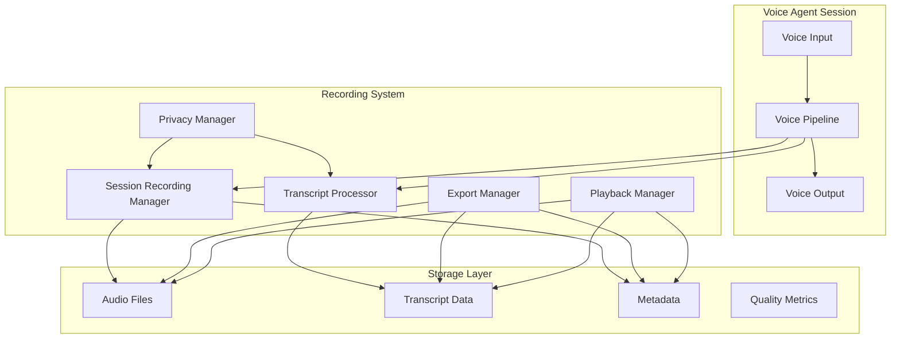

# Session Recording and Transcript Capabilities Guide

This guide provides comprehensive documentation for the session recording and transcript capabilities implemented for the Voice Agents Platform, enabling quality assurance and performance analysis for voice agent deployments.

## Table of Contents

1. [Overview](#overview)
2. [Architecture](#architecture)
3. [Components](#components)
4. [Setup and Configuration](#setup-and-configuration)
5. [Basic Usage](#basic-usage)
6. [Advanced Features](#advanced-features)
7. [Privacy and Compliance](#privacy-and-compliance)
8. [Export and Reporting](#export-and-reporting)
9. [Analysis and Playback](#analysis-and-playback)
10. [Integration Examples](#integration-examples)
11. [API Reference](#api-reference)
12. [Best Practices](#best-practices)
13. [Troubleshooting](#troubleshooting)

## Overview

The session recording system provides comprehensive recording, transcription, and analysis capabilities for voice agent conversations. It enables:

- **Real-time Audio Recording**: High-quality audio capture during voice sessions
- **Transcript Generation**: Automated speech-to-text with speaker identification
- **Quality Analytics**: Real-time quality monitoring and scoring
- **Privacy Controls**: GDPR/CCPA compliant privacy management
- **Export Capabilities**: Multiple format exports (JSON, HTML, CSV, PDF)
- **Playback Analysis**: Session replay with synchronized audio and transcripts
- **Performance Insights**: Comprehensive analytics and reporting

## Architecture



## Components

### Session Recording Manager

The core component responsible for managing recording sessions.

```python
from src.monitoring.session_recording import SessionRecordingManager, PrivacyLevel

# Initialize recording manager
recording_manager = SessionRecordingManager(
    storage_path="./recordings",
    enable_compression=True,
    enable_encryption=True,
    default_retention_days=30,
    quality_monitoring=True
)

# Start a recording session
session_id = await recording_manager.start_session(
    user_id="user123",
    agent_id="agent456", 
    privacy_level=PrivacyLevel.FULL,
    tags=["customer_support", "billing"]
)
```

### Transcript Processor

Handles real-time transcript generation and processing.

```python
from src.monitoring.transcript_processor import TranscriptProcessor

# Initialize transcript processor
processor = TranscriptProcessor(
    enable_real_time=True,
    enable_speaker_diarization=True,
    enable_keyword_extraction=True,
    confidence_threshold=0.7
)

# Start transcript session
transcript_session = await processor.start_session(
    session_id=session_id,
    user_id="user123",
    language="en",
    custom_vocabulary=["product", "subscription", "billing"]
)
```

### Privacy Manager

Manages user consent, data retention, and compliance.

```python
from src.monitoring.privacy_manager import PrivacyManager, ConsentType

# Initialize privacy manager
privacy_manager = PrivacyManager(
    storage_path="./recordings",
    consent_storage_path="./consent",
    default_retention_days=30,
    compliance_frameworks=[ComplianceFramework.GDPR, ComplianceFramework.CCPA]
)

# Request user consent
consent_results = await privacy_manager.request_consent(
    user_id="user123",
    consent_types=[ConsentType.RECORDING, ConsentType.TRANSCRIPT, ConsentType.ANALYTICS]
)
```

## Setup and Configuration

### Installation

```bash
# Install required dependencies
pip install cryptography
pip install asyncio
pip install pytest  # for testing
```

### Configuration

Create a configuration file for your recording setup:

```python
from src.monitoring.session_recording import RecordingConfig, PrivacyLevel, AudioFormat

recording_config = RecordingConfig(
    enable_recording=True,
    enable_transcripts=True,
    enable_quality_monitoring=True,
    privacy_level=PrivacyLevel.FULL,
    audio_format=AudioFormat.WAV,
    sample_rate=44100,
    retention_days=30,
    require_consent=True,
    anonymize_exports=False
)
```

### Environment Variables

```bash
# Storage configuration
RECORDING_STORAGE_PATH="./recordings"
CONSENT_STORAGE_PATH="./consent"
EXPORT_PATH="./exports"

# Privacy settings
DEFAULT_RETENTION_DAYS=30
ENABLE_ENCRYPTION=true
ENCRYPTION_KEY="your-encryption-key"

# Quality monitoring
QUALITY_MONITORING=true
REAL_TIME_ANALYSIS=true
```

## Basic Usage

### Starting a Recording Session

```python
import asyncio
from src.monitoring.session_recording import SessionRecordingManager

async def basic_recording_example():
    # Initialize manager
    manager = SessionRecordingManager(storage_path="./recordings")
    
    # Start session
    session_id = await manager.start_session(
        user_id="user123",
        tags=["demo", "basic_usage"]
    )
    
    # Record audio chunks
    audio_data = b"simulated_audio_data"
    await manager.record_audio_chunk(
        session_id=session_id,
        audio_data=audio_data,
        timestamp=time.time(),
        speaker_id="user"
    )
    
    # Add transcript segments
    await manager.add_transcript_segment(
        session_id=session_id,
        text="Hello, how can I help you?",
        timestamp=time.time(),
        speaker_id="agent",
        confidence=0.95
    )
    
    # End session
    metadata = await manager.end_session(session_id, final_quality_score=0.85)
    print(f"Session completed: {metadata.session_id}")

# Run example
asyncio.run(basic_recording_example())
```

### Integration with Voice Pipeline

```python
from src.monitoring.session_recording_integration import VoicePipelineWithRecording

async def integrated_pipeline_example():
    # Initialize pipeline with recording
    pipeline = VoicePipelineWithRecording(
        stt_provider=your_stt_provider,
        llm_provider=your_llm_provider,
        tts_provider=your_tts_provider,
        recording_config=recording_config,
        storage_path="./recordings"
    )
    
    # Initialize pipeline
    await pipeline.initialize()
    
    # Start recording session
    session_id = await pipeline.start_recording_session(
        user_id="user123",
        agent_id="voice_agent"
    )
    
    # Process audio with recording
    audio_input = b"user_audio_data"
    tts_result, metrics = await pipeline.process_audio_with_recording(
        audio_data=audio_input,
        user_id="user123",
        speaker_id="user"
    )
    
    # End session
    results = await pipeline.end_recording_session()
    
    # Cleanup
    await pipeline.cleanup()
```

## Advanced Features

### Real-time Quality Monitoring

```python
# Enable quality monitoring callbacks
def on_quality_update(session_id, quality_metrics):
    print(f"Quality update for {session_id}: {quality_metrics}")

recording_manager.add_callback("on_quality_update", on_quality_update)
```

### Speaker Diarization

```python
# Configure speaker identification
transcript_processor = TranscriptProcessor(
    enable_speaker_diarization=True,
    speaker_profiles={
        "agent_1": {"voice_characteristics": "..."},
        "user_profile": {"voice_characteristics": "..."}
    }
)
```

### Custom Vocabulary

```python
# Add domain-specific vocabulary
custom_vocabulary = [
    "subscription", "billing", "API", "webhook",
    "authentication", "authorization", "endpoint"
]

transcript_session = await processor.start_session(
    session_id=session_id,
    custom_vocabulary=custom_vocabulary
)
```

## Privacy and Compliance

### User Consent Management

```python
async def manage_user_consent():
    # Request consent
    consent_results = await privacy_manager.request_consent(
        user_id="user123",
        consent_types=[ConsentType.RECORDING, ConsentType.TRANSCRIPT],
        legal_basis="consent",
        expiry_days=365
    )
    
    # Check consent
    has_consent = await privacy_manager.check_consent(
        user_id="user123",
        consent_type=ConsentType.RECORDING
    )
    
    # Withdraw consent
    if user_wants_to_withdraw:
        await privacy_manager.withdraw_consent(
            user_id="user123",
            consent_types=[ConsentType.RECORDING]
        )
```

### Data Retention Policies

```python
from src.monitoring.privacy_manager import RetentionPolicy, DataClassification

# Define custom retention policy
custom_policy = RetentionPolicy(
    policy_id="healthcare_policy",
    name="Healthcare Data Retention",
    description="Extended retention for healthcare conversations",
    retention_period_days=2555,  # 7 years
    data_classification=DataClassification.RESTRICTED,
    compliance_frameworks=[ComplianceFramework.HIPAA]
)

# Apply retention policy
await privacy_manager.apply_retention_policy(session_id, metadata, "healthcare_policy")
```

### Data Anonymization

```python
# Enable anonymization for exports
anonymized_metadata = await privacy_manager.anonymize_session_data(
    session_id=session_id,
    metadata=original_metadata
)
```

### Legal Holds

```python
# Apply legal hold (prevents deletion)
await privacy_manager.apply_legal_hold(
    session_ids=["session1", "session2"],
    reason="Legal investigation case #12345"
)

# Remove legal hold
await privacy_manager.remove_legal_hold(
    session_ids=["session1", "session2"]
)
```

## Export and Reporting

### Single Session Export

```python
from src.monitoring.export_manager import ExportManager, ExportFormat

# Initialize export manager
export_manager = ExportManager(
    storage_path="./recordings",
    export_path="./exports"
)

# Export single session
result = await export_manager.export_single_session(
    session_id="session123",
    format=ExportFormat.HTML,
    include_audio=False,
    include_transcripts=True
)

print(f"Export completed: {result.output_path}")
```

### Batch Export

```python
from src.monitoring.export_manager import ExportRequest, ExportScope, ReportType

# Create export request
request = ExportRequest(
    request_id="batch_export_001",
    scope=ExportScope.DATE_RANGE,
    format=ExportFormat.ZIP,
    report_type=ReportType.QUALITY_REPORT,
    start_date=datetime.now() - timedelta(days=7),
    end_date=datetime.now(),
    include_audio=False,
    include_transcripts=True,
    compress_output=True
)

# Submit export request
request_id = await export_manager.submit_export_request(request)

# Check status
status = await export_manager.get_export_status(request_id)
```

### Report Generation

```python
# Generate quality report
quality_report = await export_manager.export_sessions_by_date_range(
    start_date=datetime.now() - timedelta(days=30),
    end_date=datetime.now(),
    format=ExportFormat.HTML,
    report_type=ReportType.QUALITY_REPORT
)
```

### Automated Reports

```python
# Schedule automated daily reports
await export_manager.generate_automated_reports(
    report_types=[
        ReportType.SESSION_SUMMARY,
        ReportType.QUALITY_REPORT,
        ReportType.PERFORMANCE_REPORT
    ],
    schedule_interval=timedelta(days=1)
)
```

## Analysis and Playback

### Session Playback

```python
from src.monitoring.session_playback import SessionPlaybackManager, AnalysisType

# Initialize playback manager
playback_manager = SessionPlaybackManager(storage_path="./recordings")

# Create player
player = await playback_manager.create_player(
    session_id="session123",
    enable_audio=True,
    enable_transcript=True
)

# Start playback
await player.play(start_position=0.0)

# Control playback
await player.pause()
await player.seek(30.0)  # Seek to 30 seconds
await player.resume()
await player.stop()
```

### Session Analysis

```python
# Perform comprehensive analysis
analysis_results = await playback_manager.analyze_session(
    session_id="session123",
    analysis_types=[
        AnalysisType.QUALITY,
        AnalysisType.CONVERSATION_FLOW,
        AnalysisType.SPEAKER_ANALYTICS,
        AnalysisType.PERFORMANCE
    ]
)

# Access analysis results
quality_analysis = analysis_results["quality"]
conversation_flow = analysis_results["conversation_flow"]
speaker_analytics = analysis_results["speaker_analytics"]
```

### Real-time Analysis Callbacks

```python
# Add real-time analysis callback
def on_analysis_update(session_id, analysis_data):
    print(f"Real-time analysis for {session_id}: {analysis_data}")

playback_manager.add_callback("on_analysis_update", on_analysis_update)
```

## Integration Examples

### LiveKit Integration

```python
from src.monitoring.session_recording_integration import LiveKitVoiceAgentWithRecording

# Initialize LiveKit agent with recording
agent = LiveKitVoiceAgentWithRecording(
    room_name="support_room",
    user_token="user_token",
    recording_config=recording_config
)

# Connect and start recording
await agent.connect()

# Handle audio frames
await agent.handle_audio_frame(audio_data)

# Get session analytics
analytics = await agent.get_session_analytics()

# Export session
export_path = await agent.export_session(ExportFormat.HTML)

# Disconnect
await agent.disconnect()
```

### Custom Voice Pipeline Integration

```python
# Extend your existing voice pipeline
class CustomVoicePipelineWithRecording(VoicePipelineWithRecording):
    async def custom_processing_step(self, data):
        # Your custom processing
        result = await super().process_audio_with_recording(data)
        
        # Add custom transcript data
        await self.add_custom_transcript("Custom processing completed")
        
        return result
```

## API Reference

### SessionRecordingManager

#### Methods

- `start_session(user_id, agent_id, privacy_level, ...)` - Start recording session
- `record_audio_chunk(session_id, audio_data, timestamp, speaker_id)` - Record audio
- `add_transcript_segment(session_id, text, timestamp, ...)` - Add transcript
- `end_session(session_id, final_quality_score)` - End recording session
- `pause_session(session_id)` - Pause recording
- `resume_session(session_id)` - Resume recording

#### Events

- `on_session_start` - Session started
- `on_session_end` - Session ended
- `on_audio_chunk` - Audio chunk recorded
- `on_transcript_segment` - Transcript segment added
- `on_quality_update` - Quality metrics updated

### TranscriptProcessor

#### Methods

- `start_session(session_id, user_id, language, ...)` - Start transcript session
- `process_segment(session_id, segment)` - Process transcript segment
- `end_session(session_id)` - End transcript session
- `export_transcript(session_id, format, ...)` - Export transcript

#### Configuration

- `enable_real_time` - Enable real-time processing
- `enable_speaker_diarization` - Enable speaker identification
- `enable_keyword_extraction` - Enable keyword extraction
- `confidence_threshold` - Minimum confidence for segments

### PrivacyManager

#### Methods

- `request_consent(user_id, consent_types, ...)` - Request user consent
- `check_consent(user_id, consent_type)` - Check consent status
- `withdraw_consent(user_id, consent_types)` - Withdraw consent
- `apply_retention_policy(session_id, metadata, ...)` - Apply retention policy
- `delete_expired_data(dry_run)` - Delete expired data
- `generate_compliance_report(framework, ...)` - Generate compliance report

### ExportManager

#### Methods

- `export_single_session(session_id, format, ...)` - Export single session
- `export_sessions_by_date_range(start_date, end_date, ...)` - Export date range
- `submit_export_request(request)` - Submit export request
- `get_export_status(request_id)` - Get export status

#### Formats

- `JSON` - JSON format
- `CSV` - CSV format
- `HTML` - HTML report
- `PDF` - PDF report
- `ZIP` - ZIP archive
- `XML` - XML format

## Best Practices

### Performance Optimization

1. **Use appropriate audio formats**: WAV for quality, MP3 for storage efficiency
2. **Enable compression**: Reduces storage requirements by 60-80%
3. **Batch processing**: Process transcripts in batches for better performance
4. **Monitor storage**: Implement automated cleanup for expired sessions

### Privacy and Security

1. **Always request consent**: Implement proper consent flows
2. **Use encryption**: Enable encryption for sensitive data
3. **Apply retention policies**: Automatically delete expired data
4. **Anonymize exports**: Remove PII from exported data
5. **Regular audits**: Monitor compliance with privacy regulations

### Quality Assurance

1. **Monitor quality metrics**: Set up alerts for low-quality sessions
2. **Regular analysis**: Review conversation flows and speaker analytics
3. **A/B testing**: Use recordings to test different agent configurations
4. **Training data**: Use high-quality recordings for model improvement

### Storage Management

1. **Implement tiered storage**: Move old recordings to cheaper storage
2. **Compress audio**: Use appropriate compression for your use case
3. **Monitor disk usage**: Set up alerts for storage limits
4. **Regular cleanup**: Implement automated deletion of expired data

## Troubleshooting

### Common Issues

#### Recording Not Starting

```python
# Check consent status
has_consent = await privacy_manager.check_consent(user_id, ConsentType.RECORDING)
if not has_consent:
    print("User consent required for recording")

# Check privacy level
if privacy_level == PrivacyLevel.DISABLED:
    print("Recording disabled by privacy level")
```

#### Poor Audio Quality

```python
# Check audio settings
recording_config = RecordingConfig(
    audio_format=AudioFormat.WAV,  # Use uncompressed format
    sample_rate=44100,             # High sample rate
    quality_monitoring=True        # Enable quality monitoring
)

# Monitor quality metrics
def on_quality_update(session_id, metrics):
    if metrics.audio_quality_score < 0.7:
        print(f"Low audio quality detected: {metrics.audio_quality_score}")
```

#### Export Failures

```python
# Check export status
status = await export_manager.get_export_status(request_id)
if status["status"] == "failed":
    print(f"Export failed: {status['result']['error_message']}")

# Check file permissions
import os
if not os.access(export_path, os.W_OK):
    print("No write permission to export directory")
```

#### Storage Issues

```python
# Check disk space
import shutil
total, used, free = shutil.disk_usage(storage_path)
if free < (1024**3):  # Less than 1GB
    print("Low disk space warning")

# Clean up expired data
stats = await privacy_manager.delete_expired_data(dry_run=False)
print(f"Deleted {stats['sessions_deleted']} expired sessions")
```

### Debugging

Enable debug logging for detailed information:

```python
import logging
logging.basicConfig(level=logging.DEBUG)

# Or use structured logging
from src.monitoring.structured_logging import StructuredLogger
logger = StructuredLogger(__name__, "debug")
```

### Performance Monitoring

Monitor system performance:

```python
# Check active sessions
active_sessions = recording_manager.get_active_sessions()
print(f"Active sessions: {len(active_sessions)}")

# Monitor memory usage
import psutil
memory_usage = psutil.virtual_memory().percent
if memory_usage > 80:
    print(f"High memory usage: {memory_usage}%")
```

## Support and Resources

- **Documentation**: [Complete API documentation](./api-reference.md)
- **Examples**: See `src/monitoring/session_recording_integration.py`
- **Tests**: Run `pytest src/monitoring/test_session_recording.py`
- **Issues**: Report issues via GitHub Issues

## License

This session recording system is part of the Voice Agents Platform and is subject to the same license terms.